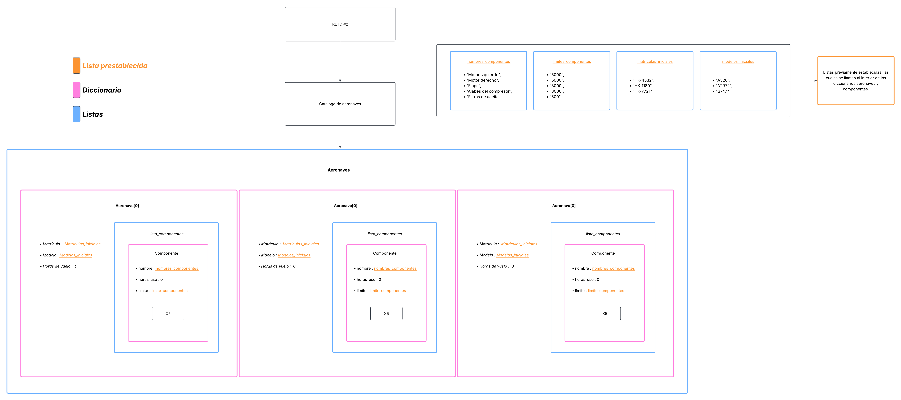

# Diagrama esctuctural del codigo

--- 

# De igual manera, a continuación se adjunta el enlace de vista del diagrama: 
### https://lucid.app/lucidchart/68c5070a-c2a9-477d-a032-c2cb1e1cebba/edit?viewport_loc=-5701%2C-2810%2C8670%2C4790%2C0_0&invitationId=inv_da193b6d-4a41-4a83-99a1-70304f01c70d
