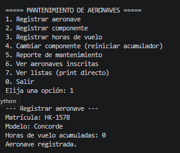
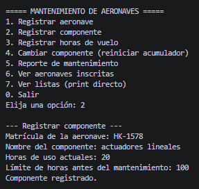
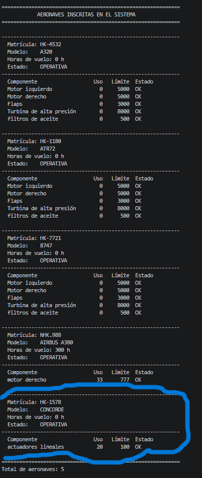
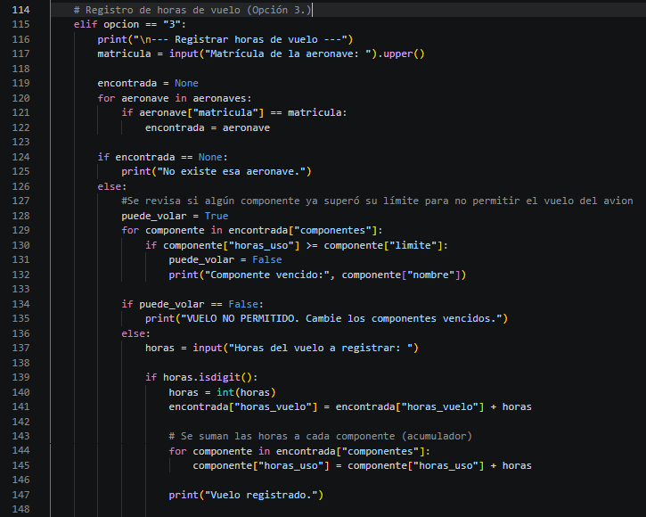
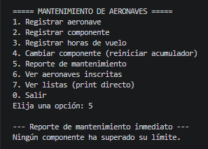
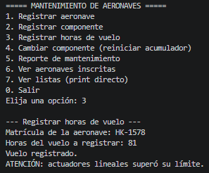
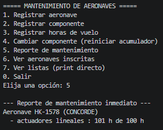
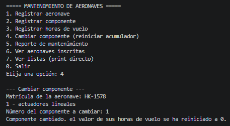
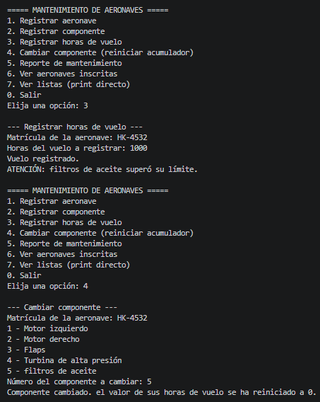
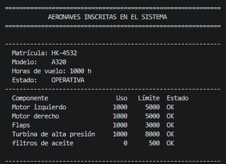

# [ Funcionamiendo de funciones bases del codigo/ step by step

> Demostrar las funciones basicas del codigo 
> **Fecha:** 08/10/2026  
> **Autores:**  [ Alejandro Arcila Rua / Gabriela Galindo Herrera]  

---

## 📋 Requisitos
Antes de iniciar, asegúrate de contar con lo siguiente:
- [ ] **Requisito 1:** Registro de nueva aeronave
- [ ] **Requisito 2:** Registro de componente a nueva aeronave
- [ ] **Requisito 3:** Parte del codigo (Agregar horas de uso)
- [ ] **Requisito 4:** Reporte de mantenimiento
- [ ] **Requisito 5:** Reiniciar horas de uso de un coponente
- [ ] **Requisito 6:** Autoevaluacion

---

## 🚀 Step by step

### Paso 1: [Nueva aeronave]

### 1.1 Lista previa, contiene tres aeronaves y 5 componentes para cada una preestablecidas:
  

### 1.2 Proceso de creacion de la aeronave

### 1.3 (Paso2) Creacion del componente

### 1.4 Verificacion de modificaciones exitosas

---

### Paso 2: [Nuevo componente]

  

---

### Paso 3: [Codigo horas de uso]

- La opcion 3 del menu evalua antes de que puedas introducir las horas de vuelo, si el avion esta en estado habilitado para vuelo (NO en estado "en tierra") derivado de algun componente que exceda las horas limite.

- En este segmento de codigo se empleo tanto for como if junto con valores booleanos para evaluar los estados pertinentes del aeronave

---

### Paso 4: [Reporte de horas de uso]

### Reporte sin alerta

  ### Adicion de horas de uso/vuelo
  

 ### Reporte de numero de horas exedido, solicitud de mantenimiento

---

### Paso 5: [Mantenimiento componente]

### Forma de realizar mantenimiento de un componente

### Alarma de componente vencido

### Revision de estado final de todos los componentes

---

### Paso 6: [Autoevaluacion]

| Autoevaluación | Integrante | Nota |
| :--- | :--- | :--- |
| - | Alejandro Arcila Rua | 5.0 |
| - | Gabriela Galindo Herrera | 5.0 | 

---
