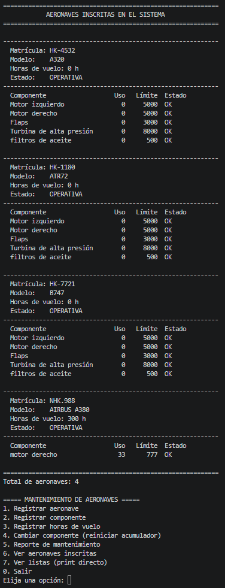

# [ Funcionamiendo de funciones bases del codigo/ step by step

> Demostrar las funciones basicas del codigo 
> **Fecha:** 08/10/2026  
> **Autores:**  [ Alejandro Arcila Rua / Gabriela Galindo Herrera]  

---

## 📋 Requisitos
Antes de iniciar, asegúrate de contar con lo siguiente:
- [ ] **Requisito 1:** Registro de nueva aeronave
- [ ] **Requisito 2:** Registro de componente a nueva aeronave
- [ ] **Requisito 3:** Parte del codigo (Agregar horas de uso)
- [ ] **Requisito 4:** Reporte de mantenimiento
- [ ] **Requisito 5:** Reiniciar horas de uso de un coponente
- [ ] **Requisito 6:** Autoevaluacion

---

## 🚀 Step by step

### Paso 1: [Nueva aeronave]

---

### Paso 2: [Nombre o resumen del segundo paso]

**Descripción / Explicación:**
Explicación detallada de la acción realizada en el paso 2.

**Evidencia Visual:**

*Figura 2: Explicación de la evidencia o resultado de este paso.*

---

### Paso 3: [Nombre o resumen del tercer paso]

**Descripción / Explicación:**
Explicación detallada de la acción realizada en el paso 3.

**Evidencia Visual:**

*Figura 3: Explicación de la evidencia o resultado de este paso.*

---

*(Puedes duplicar el bloque del Paso N para agregar todos los pasos que necesites)*

---

## ✅ Lista de Verificación Final (Checklist)
Valida que el resultado sea el correcto confirmando los siguientes puntos:
- [ ] Resultado esperado 1 comprobado.
- [ ] Resultado esperado 2 comprobado.

---

## ⚠️ Solución de Problemas Comunes (Troubleshooting)
| Problema / Error | Causa Posible | Solución Sugerida |
| :--- | :--- | :--- |
| Error X | Falta de permisos | Ejecutar como administrador |
| Error Y | Ruta incorrecta | Verificar la dirección del directorio |

---

## 📌 Notas Adicionales
- Agrega aquí cualquier observación extra o buenas prácticas a considerar.
